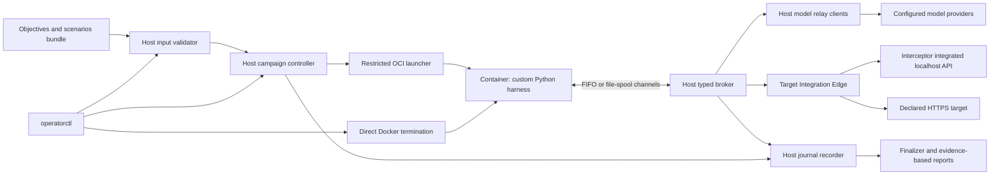

# Intrusive AI Operator Sandbox Product Specification

Status: core runtime and administrator workflows implemented; HTTPS adapter, release publication and full integration/runtime qualification outstanding\
Date: 2026-09-28\
Product API family: `operator.dev`; existing data schemas remain individually versioned  
Container runtime profile: `operator-container/v1` — Docker with Linux FIFO / macOS file-spool transport; qualification pending

## 1. Purpose and design authority

Operator Sandbox accepts structured objectives and optional scenarios, runs
contained adaptive AI attack simulations, and produces evidence-based local reports.
Users and external generators submit the same versioned ScenarioBundle. Attack Harness
(`operator-native`) invents payloads, chooses experiments and adapts to
permitted feedback. Operator validates inputs against local policy, brokers every
model and target operation, and retains execution records and evidence.

The guest is one disposable Linux Docker container running a Python harness.
Its model-facing tools are the closed catalog in Section 6.1. This document and
[the guest contract](GUEST_CONTAINER_SPEC.md) define the implementation requirements.

The [Attack Harness container specification](../attack_harness/GUEST_ARTIFACT_LAYOUT_SPEC.md)
refines Python/image layout and harness behavior while consuming this product's
shared schemas and the container ABI. Interceptor retains ownership of its
native interfaces. Changes needed there are recorded, not silently assumed.
The accepted [shared host/harness contract](schemas/SHARED_CONTRACT.md) is the
single authority for the pipe envelope, identities, startup/manifest exchange,
deadlines, errors, restore results and completion. Operator owns its versioned
`operator-contracts` package; both ends pin its version and content digest.
Closed schemas, Go/Python validators and shared fixtures, and the host/harness runtimes
are implemented. Package publication and complete process/native conformance remain
outstanding. See [current implementation status](docs/IMPLEMENTATION_STATUS.md) for
completed work and remaining gates. MUST denotes a requirement, not proof of acceptance.

The [host transport implementation](docs/HOST_TRANSPORT.md) supplies FIFO/spool
I/O, bounded queues, deadlines and confirmed-exit transport cleanup. Its integration
with Docker, startup verification and the durable broker is implemented and tested
with scripted peers; full native host qualification remains outstanding.

## 2. Principal requirements and boundaries

1. Provide one CLI for staged or end-to-end input submission, validation,
   execution, evidence collection and reporting. Accepted campaigns outlive their terminal.
2. A structured ScenarioBundle supplies objectives, optional hypotheses, candidate
   surfaces, coverage goals and evidence expectations. The harness owns tactical
   choices and payloads, including experiments for objectives-only submissions.
3. Scenario/taxonomy prose and skills are guidance. They neither grant authority
   nor become a second allowlist of permitted attack ideas. Host policy enforces
   explicit scope, typed operations, feedback, effects, resources and deadlines.
4. Keep the full verified ScenarioBundle, exact selected skills, effective system
   prompt and permitted reference artifacts as immutable guest-readable inputs.
5. Guest communication uses private named pipes on Linux and file-spool transport
   on macOS, never IP networking.
   Only trusted host components contact providers, secret stores and targets.
6. Treat the entire harness/container as potentially compromised. Its limited
   tool catalog reduces accessible actions; host validation is independently
   required even if the harness fabricates requests.
7. Journal all broker/model traffic and lifecycle decisions. Provide direct Docker
   termination without harness or campaign-worker cooperation; Docker must respond.
8. A failed, stopped or completed campaign cannot resume execution. Journals
   support reporting and bounded cleanup. Healthy planned target restores may
   advance target revisions while preserving the live harness and cumulative budgets.
9. Interceptor is the primary target adapter. Preserve a declarative HTTPS
   adapter for operation without Interceptor, with explicitly weaker evidence
   where only external responses are observable.
10. Guest releases are prebuilt, verified and immutable. Run preparation packages
    data; it installs no executable dependencies and rebuilds no guest image.
11. Customer skills retain separate `skill build` and digest-based attachment
    steps. Neither adds a confirmation workflow or executable capability.
12. Evidence completeness, execution status, cleanup status and report status
    remain independent. Reports identify uncertainty and unsupported coverage.

Source assessment, Blueprint authoring/review, target application images and
target sealing remain onboarding inputs. Operator does not invent their missing
facts. Interceptor's own target containment is unchanged by the guest migration.

## 3. Architecture and trust model



### 3.1 Components

| Component | Responsibility |
|---|---|
| `operatorctl` | Bounded input ingestion, saved workflow, receipts, status, logs, wait, terminate and report commands. |
| Campaign controller/worker | Durable ownership, policy, cumulative accounting, target binding, one active revision and finalization. |
| Restricted launcher | Fixed Docker setup/teardown, immutable image and mount inventory, transport setup, exact Docker container identity and launch fencing. |
| Host broker | Closed engine protocol, independent validation, reservations, deterministic translation and dispatch. |
| Model relay clients / credential resolver | Provider-native calls and host-only credential resolution for the engine relay. |
| Bundle validator | Strict public input validation, capability binding, reference inventory and immutable staging; no model call. |
| Target Integration Edge | One adapter-neutral capability and execution contract; native provenance remains distinct. |
| Python harness | Bounded adaptive loop, native model codecs, fixed tool dispatch, skills, artifact creation and conclusions. |
| Host journal / audit recorder | Broker/model records, lifecycle outcomes and durable evidence inventory. |
| Administrative termination | Separate CLI process kills the exact container through Docker without campaign-worker cooperation. |
| Skill publisher / release verifier | Separate scoped skill publication and immutable release/input selection. |

Operator host tooling is Go, built for Linux x86_64 (`linux/amd64`), Linux
AArch64 (`linux/arm64`), macOS x86_64 (`darwin/amd64`) and macOS ARM64
(`darwin/arm64`). The Python harness always runs in a native-architecture Linux
container. Linux uses local Docker Engine and named FIFOs; macOS uses local
Docker Desktop and regular-file spooling through its Linux VM. Operator and
Interceptor run on the same physical machine and use its local Docker installation.
A small release-owned native component may install Python's final confinement.
The [host runtime profiles](HOST_RUNTIME_PROFILES.md) define the support matrix,
confirmed supported versions, selected MVP controls and remaining implementation
gates. Selected service/confinement probes have passed; complete production-image
testing on all four host tuples remains outstanding. OS/Docker versions are not an
admission allowlist.

### 3.2 Security properties and limits

Linux containers share their execution kernel: the native Linux host kernel or
Docker Desktop's Linux VM kernel. A kernel/runtime escape can affect that execution
environment. Journals do not establish integrity after compromise of trusted components. Namespaces, capabilities, resource controls and security profiles
restrict guest access. [Docker's security documentation](https://docs.docker.com/engine/security/)
describes these mechanisms and the runtime's privileged attack surface.

No-shell tooling prevents a model from requesting arbitrary execution through
the documented interface. Python still executes application code and has powerful
standard-library capabilities. The implementation MUST NOT evaluate model text,
load code from writable inputs, unpickle untrusted data, or expose an arbitrary
callable/import dispatcher. Image minimization alone is not a Python sandbox.

Protected assets include host credentials, provider/target destinations, launcher
authority, runtime sockets, Interceptor state and evidence, signing keys, audit
files, immutable releases, other campaigns and cumulative campaign limits.
Host administrators, the host kernel, local Docker daemon, launcher and broker are trusted; on macOS this includes Docker Desktop and its VM.
Scenario, skill, model, target, guest-record and report content are untrusted.

## 4. Container execution baseline

The exact release profile MUST enforce the following before live admission.
Detailed startup sequencing and image composition are in the guest contract.

| Area | Required baseline |
|---|---|
| Runtime | Local Docker Engine (Linux) or Docker Desktop (macOS) satisfying required capabilities and fixed launcher policy; fixed entrypoint/argv; no campaign-provided Docker context, configuration, hooks or flags. |
| Identity | Nonroot guest UID/GID; separate user-namespace remapping optional; empty capabilities; `no_new_privs`; no supplementary authority. |
| Namespaces | Private mount, PID, IPC, UTS and network namespaces, with runtime-provided cgroup isolation; separate user namespace optional; no joining host/target namespaces. |
| Network | Empty private network namespace: no veth/TAP, routes, CNI attachment, host networking, published ports or external DNS. Deny socket creation in the harness syscall profile. |
| Filesystem | Immutable read-only root; exact host-created input/skill/manifest trees mounted read-only and nonrecursive with private propagation; regular input files mode `0444` and directories `0555`; private OS-specific transport mounts as Section 6.2; bounded fresh scratch only. |
| Host access | No Docker/containerd sockets, KVM, host devices, home directories, source checkout, target volumes, credentials, host `/proc` or writable cgroup mounts. |
| Execution | Fixed Python startup only; deny additional `execve`, `execveat`, process creation and arbitrary code evaluation before processing untrusted inputs. |
| Kernel controls | Restricted startup seccomp plus a tighter live allowlist installed by trusted bootstrap; no unfiltered fallback. Docker mounts and ordinary permissions enforce the filesystem baseline; additional AppArmor/SELinux/Landlock policy is optional. |
| Resources | CPU, memory, swap, PIDs, descriptors, scratch bytes/files, transport message/queue limits, audit/artifact bytes, deadlines and cumulative request/token ceilings. |
| Lifecycle | Persist exact Docker daemon/container binding before start; restart policy disabled; journal and Docker control ready before harness initialization. |

For Docker terminology, the network setting corresponds to `--network none`.
That setting still creates loopback; it does not by itself deny IP socket syscalls.
The proposed profile additionally denies socket creation, including IPv4, IPv6,
packet, netlink and vsock. FIFOs and regular-file spools need no sockets. [Docker documents the remaining
loopback interface](https://docs.docker.com/engine/network/drivers/none/).

Use a narrow launcher against the configured local Docker daemon. Docker manages
container creation and image storage; Operator fixes security/mount/resource policy,
transport and exact-container lifecycle. Generic Docker defaults do not qualify
startup confinement. Remote Docker contexts/daemons are outside the MVP.
On macOS, host paths and permissions must work through the selected Docker Desktop
file-sharing backend. See the host profiles for confirmed supported versions and
initial feasibility tests; version-list membership is not a startup requirement.

Initial resource ceilings:

| Limit | Initial value, narrowed by deployment policy |
|---|---|
| Simultaneous campaigns per execution host | 1 |
| Guest CPU / memory | 2 CPU equivalents / 4 GiB; swap disabled |
| Attempt admissions / active campaign duration | 100 / 30 minutes across all revisions; numbering is separate from admission charging |
| Harness model turns / dispatched tool calls / calls per response | 300 / 2,000 / 16; configurable `limits.harness` |
| Invalid tool calls total / consecutive | 50 / 5; configurable |
| Cumulative reference/skill/feedback reads / no-progress model turns | 256 MiB / 10; configurable; see shared execution rules |
| Campaign model tokens | 250,000 input + output tokens |
| In-flight model requests / target invocations | 1 / 1; initially one ordinary engine request overall |
| Model request wall time | At most 120 seconds, also bounded by remaining campaign time |
| Individual artifact / cumulative artifacts | 16 MiB / 1 GiB |
| Campaign snapshot creation admissions / cumulative committed snapshot bytes | 20 / 1 GiB (1,073,741,824 bytes); configurable independently of artifact ceilings |
| Confinement/readiness / input initialization | 60 seconds each |
| Snapshot create/restore / other ordinary requests | At most 300 / 30 seconds; all requests also bounded by remaining campaign time and applicable adapter timeout |
| Harness progress timeout | 180 seconds for idle/stalled work; a host-known admitted operation uses its own deadline; heartbeats cannot extend limits |
| Guest tasks / open descriptors | 16 / 256; normal harness uses one process/thread |
| Work / temporary space | 128 MiB + 8,192 inodes / 32 MiB + 2,048 inodes; charged to memory |
| Immediate Docker termination | Confirm stopped within 5 seconds on a responsive Docker installation satisfying runtime requirements; timeout/unreachable Docker means unconfirmed termination |

Limits are inclusive and finite. Omission selects the effective default, never
unlimited; invalid zero values fail where a positive limit is required. Unknown
usage reserves the maximum possible charge until reconciled. No refund resets a
campaign ceiling. Host broker and recorder need reserved resources so
container exhaustion cannot consume their entire operating budget.

[Harness execution rules](schemas/HARNESS_EXECUTION_RULES.md) define the exact
loop defaults, overrides, accounting, progress and finalization behavior. The host
supplies resolved `EngineContext.limits.harness` and the initial campaign
`attempt_index_high_watermark`, journals observable charges, and retains its
counters across restores. The harness retains its local counters/allocator.
Local progress claims never increase host budgets or extend hard termination.

## 5. Guest release, inputs and custom skills

### 5.1 Release identity and immutable staging

An approved local Docker image and its HTTPS release compatibility record bind
the image identity, shared contract and runtime profile. The immutable image's
embedded engine manifest records harness source/build identity, Python ABI,
dependencies/SBOM, codecs, tool catalog, skill loader, prompt and confinement
component. Operator checks these against installed policy and actual runtime
capabilities; OS/Docker version-list membership is not required.
[Release discovery and compatibility](schemas/ENGINE_RELEASE_CONTRACT.md) defines
the authoritative image key, response and cache rules. Record registry manifest/index digests separately
when available; launch uses the full verified local Docker image ID.

The recommended runtime base is `gcr.io/distroless/python3-debian13:nonroot`,
pinned by digest after qualification. It omits shells and package managers and
supports the intended amd64/arm64 targets. The [guest image discussion](GUEST_CONTAINER_SPEC.md#2-python-base-image)
explains build compatibility and the development alternative. These are image
recommendations, not a measured minimum-size claim or selected production digest.

Before launch, Operator copies validated data into service-owned immutable
staging. Never bind a mutable caller directory into the guest. Input trees have
canonical names, bounded files/depth/bytes, fixed read-only modes and a content
manifest; host source paths do not appear in guest data. No symlinks, hard links,
special files, nested mounts, executable metadata or unmanifested entries.
The container cannot mount filesystems or access a raw filesystem image.

The [host input staging implementation](docs/INPUT_STAGING.md) materializes exact
validated manifest inventories into private service-owned mount trees and verifies
their actual bytes, names and fixed modes. Reverify before Docker exposure; retain
the backing trees throughout the harness lifetime. Staging completion does not
replace release/skill/target admission or the RunManifest/startup binding checks.

```text
/run/operator/input/scenario-bundle.json
/run/operator/input/system-prompt.txt
/run/operator/input/run-context.json
/run/operator/input/artifacts/sha256-<hex>
/run/operator/customer-skills/<skill_id>/SKILL.md
/run/operator/customer-skills/<skill_id>/<manifest-listed-reference>
/run/operator/manifests/input-tree.json
/run/operator/manifests/skill-set.json
/run/operator/manifests/<fixed-per-skill-manifest>
/run/operator/ipc/{ordinary-in,ordinary-out,control-in,control-out}
/run/operator/work/
/tmp/
```

Full input/skill inventories live in the separate immutable manifest mount;
startup carries only bounded descriptors with fixed path IDs, raw size/digest
and canonical object identity. Apply the accepted [manifest rules and limits](schemas/SHARED_CONTRACT.md#7-full-inputs-and-skill-manifests-without-oversized-control-frames),
including self-inventory exclusion and separate manifest resource accounting.

The original complete engine-visible ScenarioBundle remains a separate file;
do not flatten it into EngineContext or replace it with a summary. Resolve only
authorized engine-visible supporting artifacts. Missing required inputs fail
preparation. Optional omissions are allowed only by the bundle and are frozen
with explicit reasons. Host policy secrets and protected evidence are excluded.

EngineContext contains initial revision identity, input descriptors and fixed paths,
exact skill inventory, safe target delivery schemas/selectors, model codec and
permitted features, and remaining limits. Host state independently enforces them.
The shared [input-content contract](schemas/ENGINE_INPUT_CONTRACT.md) fixes its
closed schema and cross-file validation, including initial budget narrowing at
admission and explicit included/omitted reference mappings.
Hash dependencies are acyclic:

```text
frozen scenario + prompt + references + skills + capabilities + policy + initial revision
  -> EngineContext -> InputTreeManifest -> RunManifest -> startup binding
```

EngineContext contains neither its own digest nor the input/run-manifest digest.
RunManifest binds the image/profile, input-tree digest, original campaign inputs,
target/native source binding, retention and remaining limits. The host allocates
`launch_id` and container identity before hashing it; launch records subsequently bind the actual
full Docker container ID, local daemon binding, host platform and selected transport.
Kernel-specific process/cgroup observations are optional diagnostics, not identity prerequisites.
There is no cyclic reference to a future process identity. EngineContext and
RunManifest describe the immutable harness launch. A healthy target restore
updates the active campaign revision and target binding through a durable
transition record and correlated tool result; it does not rewrite mounted
inputs, change launch identity or reinitialize the harness (Section 10.3).

The concrete host-private fields, digest recipe and exact Docker binding are
defined in [Host campaign persistence](docs/CAMPAIGN_PERSISTENCE.md). Its Go
implementation validates the manifest against the existing shared startup and
input identities. Docker create/start and live admission remain separate gates.

### 5.1.1 Local Docker image configuration and release validation

The administrator supplies one required image selector in the installed host
configuration file (`/etc/operator/config.yaml` on Linux; macOS location follows
the installation decision in HOST_RUNTIME_PROFILES.md):

```yaml
engine:
  image: registry.example.com/intrusive/attack_harness:1.2.3
```

The value selects an image **already installed in the local Docker installation** used
by Operator. Accept a local name/tag, locally present repository digest reference,
or full Docker image ID. No registry credentials belong in Operator configuration.
The administrator installs and updates images. Resolve all references locally;
an omitted tag means the existing local `latest` tag. Missing local content is an actionable startup error.

Before accepting a new campaign, resolve the selected native-platform image
locally and pin its full Docker image ID. Use the fixed HTTPS release URL
`https://releases.intrusive.ai/sha256/<64-hex-image-ID>` under the
[release contract](schemas/ENGINE_RELEASE_CONTRACT.md), or reuse its valid local
cached response. Validate image identity, minimum Operator version, exact installed
shared-contract version/digest, platform and installed runtime profile capabilities. OS/Docker versions need not
match the informational confirmed-supported list.
The release key is Docker's image/config ID, not a repository manifest/index digest.
The full shared contract remains installed locally rather than fetched from this URL.

Create by that immutable image ID with pulling forbidden; verify the created
container's image before starting it. Check compatibility before any guest code
executes. A new local image selection invalidates image-dependent prepared inputs;
rebuild and revalidate them before acceptance. Accepted start retries retain their
original pin and receipt. Record configured selector, image/platform identities,
release response bytes/digest and retrieval/cache provenance in startup metadata.
Retain the image and validated response while in use. No automatic replacement or
fallback image is allowed when content or compatibility checks fail.

The release response is cached by trusted origin and image ID and can be reused
for later campaigns while rechecking current host compatibility. An uncached
lookup failure, unknown image, corrupt metadata without a successful refetch, or
unmet requirement fails startup. The MVP has no automatic cache expiry/revocation
polling; the release contract documents administrator eviction and audit retention.
Image selection and release lookup are host preparation; the guest remains offline.

The [image preparation layer](docs/IMAGE_PREPARATION.md) implements local native
image resolution, selector/pin rechecks, fixed-origin release lookup and private
cache validation. The [host configuration loader](docs/HOST_CONFIGURATION.md)
implements private YAML loading and read-only CLI validation. Embedded release-file
inspection and container creation/start are integrated into the installed launcher.

### 5.1.2 Spool size configuration

The same administrator-owned configuration file accepts:

```yaml
spool:
  max_bytes: 536870912  # 512 MiB
```

`spool.max_bytes` is a positive integer byte limit, defaulting to 512 MiB. It is
host policy, fixed for a campaign launch and retained across target restores.
On macOS, Operator checks the combined file spool every second and shuts down
the Attack Harness container when the measured size exceeds the limit. Follow the exact
[counting, failure and cleanup rules](HOST_RUNTIME_PROFILES.md#host-spool-size-check).
Linux's FIFO transport does not use this check. This threshold is independent of
protocol message/queue limits and journal/artifact budgets.

### 5.2 Instruction-only skill support

Preserve the two independent steps:

```sh
operatorctl skill build --project project-01 --source ./skills/custom-injection
operatorctl campaign start --run ./runs/support-agent --skill sha256:<manifest-digest>
```

The MVP skill-signing trust root MUST be a host-local Ed25519 key created by an
explicit administrator `operatorctl skill keygen` command. Its private key MUST
remain in the private Operator configuration directory. Skill build MUST sign the
immutable manifest identity; skill import and campaign start MUST verify both the
local signature and inventoried file bytes. Only that installation's configured
public key grants skill-signing trust; bundle content MUST NOT install a trust key.
The [local skill contract](docs/SKILLS.md) defines key paths, source validation,
signature preimages, installed bundle layout and selection behavior.

`skill build` ingests regular files using descriptor-relative no-follow traversal,
validates/normalizes content, publishes a signed immutable SkillBundle and returns
a bounded receipt. It never starts a campaign. Launch selects already-built
artifacts by repeatable `--skill`; `--skill-set` selects a frozen set instead and
cannot be mixed with individual selections. Omission uses the prepared selection
or canonical empty set, never all installed skills. Missing metadata yields an
actionable error, not an interactive confirmation. Build/launch retries preserve
their separate idempotency intents.

A skill contains a root `SKILL.md` with a closed name/description frontmatter
subset and optional bounded UTF-8 Markdown, text, JSON or YAML references.
Reject executable components, hooks, package archives, binary modules, MCP/LSP
configuration, plugin/agent/command registration and dynamic interpolation.
Reject unsafe paths, escaping links, duplicate/colliding normalized names,
special files, xattrs/capabilities, setuid/setgid metadata and changed-source
ingestion. On macOS only, ingestion MUST permit the automatically assigned
`com.apple.provenance` attribute; it MUST reject all other extended attributes.
Build MUST copy only normalized file bytes, never source filesystem attributes.
YAML uses a data-only safe parser with bounded aliases/depth.

Use product-built **data bundles** and verified
immutable directory trees. The signed bundle binds normalized path, size, media
type and content digest for every file. The trusted host-side `operatorctl skill build` implementation MUST parse and
validate the complete input inventory before using the local signing key. It MUST
NOT execute submitted files, scripts, hooks or commands. It MUST sign only validated
instruction-only bundles, never executable releases. Storage/archive decoding is bounded and cannot install code.

The SkillSetManifest binds exact bundle digests in canonical skill-ID order,
loader schema/implementation, entrypoints and aggregate loading digest. Initially
allow at most 16 skills and 64 MiB total normalized bytes, further narrowed by
deployment policy. File-count/depth/per-file ceilings are mandatory in the final
packaging schema. Exceeding any limit fails the entire selection before launch.

The loader opens every and only manifest-listed entrypoint at the canonical
mount root, verifies the set and records loaded identities. It does not discover
plugins or scan ambient directories. Reference reads use only manifest-listed
files. Skills cannot set tools, environment, launch arguments, policies or code
paths. Requests in skill prose to execute code cannot create an execution tool.
Skills and prompts MUST remain unchanged across revisions. `skill remove` MUST
remove an installed bundle for future selections while preserving frozen campaign
inputs. Build/import MUST permit adding that same valid digest back. Administrators
MUST use campaign termination to stop running work. Instruction-only does not mean semantically benign.

### 5.3 Default and selected system prompt

The release includes an exact nonempty UTF-8 default prompt. Preserve
`--system-prompt <file>` for full replacement and repeatable
`--system-prompt-append <file>` for extension, on `run`, `campaign prepare` and
`campaign start`. Replacement and extension are mutually exclusive.

Default uses the base bytes; replacement uses only replacement bytes; extension
joins the base and each append file in CLI order with exactly two LF bytes
between inputs. No hidden prefix, templating, newline normalization or semantic
approval. Reject invalid UTF-8, NUL, empty/whitespace-only inputs, more than 16
append files or more than 131,072 effective bytes. Freeze source descriptors,
mode, base provenance and effective byte digest before acceptance.
The shared [prompt provenance and composition contract](schemas/ENGINE_INPUT_CONTRACT.md#prompt-provenance-and-composition)
defines the exact metadata and matching Go/Python composition/validation APIs.

Every model turn uses that exact effective system text and an independently
supplied fixed tool catalog. Skill/scenario/target text remains identified as
reference or tool-result data. Replacing the prompt cannot change authority.
Accepted retries never reread edited source files; changed inputs require a new
campaign. Prompt bodies stay out of public receipts and ordinary stdout.

## 6. Harness tools and non-network communication

### 6.1 Minimal harness surface

The native dispatcher uses a release-owned mapping from exact tool names to
reviewed functions with closed schemas. No reflection, arbitrary Python callable,
dynamic import, generic HTTP client, file-path-based dispatch, shell, `exec`,
`eval`, subprocess, package installer or arbitrary MCP server is exposed.
Generated payload text is data even when it contains source code.

Model-visible tools may include bounded reads of staged references by manifest
ID and structured payload/artifact construction, alongside the logical engine
operations below. They have no general host filesystem access. A convenience
artifact tool can wrap begin/part/commit without exposing file paths. Model
generation is an internal loop operation, not a model's recursive tool.

| Logical engine operation | Allowed purpose |
|---|---|
| `engine.model_generate` | One bounded provider-native non-streaming request through the selected host profile. |
| `engine.artifact_begin`, `engine.artifact_put_part`, `engine.artifact_commit` | Upload bytes with size/media/digest declaration; obtain a host-verified committed receipt. |
| `engine.injection_delete` | Remove one known injection by attempt receipt/action ID in the current target; confirmed absence is successful cleanup. |
| `engine.attempt_execute` | Submit one structured attempt with explicit tactical fields, committed artifacts and observation selection; return a fixed feedback manifest. |
| `engine.observation_read` | Read bounded, already-filtered feedback bytes by attempt receipt and entry ID; no general artifact-store access. |
| `engine.record_append` | Bounded hypotheses, progress, lineage, conclusions and evidence references; guest assertions are labeled. |
| `engine.request_stop` | Commit graceful completion with conclusion receipts or an explicit unavailable conclusion; acknowledge closed execution admission and required guest exit. |
| `engine.restore_request` | Restore an explicit checkpoint; Operator validates and executes the transition without restarting the harness. |
| `engine.snapshot_request` | Create a checkpoint with optional `label` and `description`; Operator supplies the campaign ID. |
| `engine.snapshot_list`, `engine.snapshot_inspect` | Read permitted campaign checkpoint metadata, including campaign ID and description, across retained source sessions. |

No release publication, secret retrieval, native `session.owner`,
target provisioning, administrative evidence export or runtime operation is an
engine tool. The initial Python loop is single-process, single-threaded and
event-driven; dependencies requiring child processes/threads are incompatible
until a separately reviewed release changes that profile.

### 6.2 Non-network transport

The custom harness uses four logical one-way channels: ordinary requests and
responses, and host/guest control. Linux carries them on mounted named FIFOs;
macOS carries them on private regular-file spools. The
[guest transport contract](GUEST_CONTAINER_SPEC.md#4-non-network-transport-and-launch-identity)
defines the mounts and endpoint rules. Input/skill/manifests remain separate,
immutable read-only mounts on both platforms. No Docker socket enters the guest.

Host-controlled mounts, access permissions and exclusive launch assignment bind
the channels. IDs are consistency checks, not guest-granted authority. Linux
bootstrap opens verified directional FIFOs at FD 3–6. macOS bootstrap initializes
the fixed spool lanes; it does not assign FIFO descriptors. Both use the same
typed messages, operation identities, deadlines and five-message startup.

Healthy target restores retain the transport and sequence counters. A failed
channel is terminal; leftover spool files cannot resume execution or replay
unknown effects. Control remains serviceable during ordinary waits. Administrative
termination calls Docker directly and does not depend on either transport.
No guest listener, integration token or TLS key is introduced. External host HTTPS
connections still validate TLS.

Use the accepted `operator.dev/engine-pipe/v1alpha1` envelope. Linux prefixes
each strict UTF-8 JSON object with a four-byte unsigned big-endian length; macOS
publishes one complete JSON object per file. Maximum ordinary JSON size is
4 MiB encoded; control is 64 KiB. Artifact parts contain at most 256 KiB raw bytes, with encoded
overhead counted. Commands/results carry protocol version, consecutive per-direction
sequence, request correlation, bounded operation payload and deadline. Durable
operation identity is distinct from a transport request ID.

Reject malformed encoding, duplicate keys, unknown fields/enums/operations,
trailing JSON values, invalid numbers, excess nesting/counts and over-limit
lengths before allocation or dispatch. No JSON extraction from prose, type
coercion, field repair or fallback execution. Host and harness consume one
versioned `operator-contracts` package with an exact version/content-digest pin.
Remaining schema authoring and conformance must finish before package publication.
The accepted [envelope, identity, digest and deadline rules](schemas/SHARED_CONTRACT.md#2-common-types-and-identity)
require distinct `call_id` and durable `operation_id`; nested attempt `request_id`
equals `operation_id`. Exact duplicates return saved results, while changed
commands conflict; caller worker/revision attribution does not change access.
Lookup of recorded effects precedes obsolete target-binding checks.

Guest requests carry relative `timeout_ms`; the host enforces the minimum of
that request, operation policy and remaining campaign time using a monotonic clock.
Use the shared bounded error shape and effect/disposition rules; an uncertain
outcome never becomes permission to resubmit. Each ordinary queue is at most two
frames/8 MiB; each control queue 16 frames/1 MiB. FIFO partial-frame transfer and blocked writes time out after five seconds;
spool publication, consumption acknowledgement and full-queue waits have the same bound. Response availability
uses the operation deadline; polling never renews it. Startup follows `bootstrap` → `confinement_ready` →
`initialize` → `initialized` → `admission_open`, with independent host gates.

The host independently derives project, target/session, worker, provider, allowed
operations, artifact visibility and budgets. Guest copies are consistency checks.
Frames cannot select routes, credentials, host paths or native administrative
operations. One ordinary request is initially outstanding; transport and control
pumps continue during model/target waits. Separate queues have finite capacity.
Unexpected loss of either required channel, protocol desynchronization or a stalled
required consumer ends execution. Expected EOF after accepted graceful stop is normal teardown.
Repeated invalid tool submissions are bounded.

## 7. Model relay and credentials

The [model codec contract](schemas/MODEL_CODEC_CONTRACT.md) defines the implemented
shared model request/result bodies, initial Chat Completions text/function subset,
trusted profile binding and correlated native conversation segments. Its offline
fixtures do not qualify a live provider route or implement the host relay.

The engine relay uses Operator's host provider-client implementation and credential
resolver. Interceptor's target-model bridge remains independently owned. Retain the
constrained native families: OpenAI Chat/Responses, Anthropic Messages, Bedrock
Converse, Gemini Developer API, Vertex Gemini, Azure OpenAI and LiteLLM.
Each route/model/codec/authentication combination needs explicit qualification;
a codec test does not qualify all its cloud variants.

The guest builds a supported native request through a local codec and receives
one complete bounded native result. Preserve system instructions, text and
client function boundaries, tool IDs/order, finish reasons, usage and supported
reasoning-continuation fields. No partial tool execution. Unsupported semantics
fail explicitly. The host validates like-for-like requests; it never silently
translates between provider families. No streaming, provider-hosted tools,
arbitrary URLs, persistent provider state, HTTP shim or synthetic API keys.

The [host provider profile](docs/MODEL_PROVIDERS.md) implements route selection.
ModelProviderProfile selects trusted endpoint/model/deployment, exact codecs,
supported features, limits and credential references. Guest requests cannot
override headers, route, region, cloud project, provider or credentials. Disable
hidden SDK retries for possibly dispatched calls; preserve unknown outcomes and
worst-case reservations. Cancellation does not establish that no tokens were used.

The [host credential configuration](docs/CREDENTIALS.md) defines installed
profiles, private loading and backend authentication. Keep one host resolver for AWS Secrets Manager, Azure Key Vault, Google Cloud
Secret Manager and HashiCorp Vault, using workload identity or configured Vault
Agent/Proxy bootstrap. Secret-store resolutions MUST follow the
[campaign audit contract](docs/CREDENTIALS.md#campaign-resolution-audit), including
recorded failures/cache hits and withholding values after an audit failure. Production credentials do not arrive through campaign
files, skill content, CLI secret values or guest environment. Provider/target
credentials and private endpoints never enter guest files, diagnostics, audit
authority fields or crash dumps. Explicit synthetic test credentials are separate
fixtures and cannot qualify production secret handling.

## 8. Target Integration Edge and attempts

### 8.1 Capability-driven execution

TargetProfile selects a reviewed adapter, target scope, authentication/lifecycle
binding, permitted effects and feedback, timeouts and resource ceilings. The host
creates one TargetCapabilityManifest with a secret-free export for bundle authors
and an execution projection for the harness. The closed schema, public reference
namespaces and Interceptor mapping are defined by the
[capability export contract](schemas/CAPABILITY_EXPORT_CONTRACT.md). Descriptive
plans need no capability enumeration; references express explicit dependencies.
Public action references are distinct from attempt-local action IDs.
Capabilities include application operations, bounded input/output media/schemas,
field descriptions, safe selector domains, placement/payload types, benign
examples with provenance, optional state management and evidence assurances.

Private host/control paths, URLs, credential selectors, protected fixtures and
oracles never appear as guest selectors. Public logical service paths and JSON
Pointers may appear where required for delivery. Missing required input context
blocks preparation; unknown output schemas are explicit limitations. Static
capability identity excludes readiness, session/worker IDs and remaining budgets.

The [attempt allocator](schemas/HARNESS_EXECUTION_RULES.md#1-campaign-wide-attempt-numbering)
assigns campaign-wide increasing indices and fresh request/attempt IDs before
validating each decoded new submission. Rejected allocated submissions keep their
numbers; corrections get new numbers, exact duplicates do not. Operator journals
identifiable submissions/high-water marks before semantic rejection or execution
admission. Skipped calls and undecodable/non-object arguments allocate nothing.
The default 100-attempt budget counts admitted execution after validation, not
indices or local/host pre-admission rejections. Failed admitted attempts retain
the charge. Same-campaign restores reset neither numbering nor admission counts.

An EngineAttemptRequest names its lineage/origin, payload and optional carrier
receipts, declared setup actions, one application invocation, observation request
and cleanup choice. The harness owns all tactical fields. A correctable local
schema rejection has no target effect; host validation independently checks exact
artifact bytes/media/digests, campaign association, lineage, delivery schemas, selector bounds,
capabilities, native revisions and cumulative policy before contact.

Translation is deterministic over the validated request, adapter version and
bound facts. It performs no I/O, model call, tactic selection or prose repair.
Delivery records and fills typed runtime slots from trusted session revisions
and receipts; it cannot replace payloads or infer a different action.
The sequence is registration, declared setup, one invocation, permitted feedback
and bounded cleanup. Setup failure prevents invocation. Record every step and
known/unknown effect. Removing an injection does not undo application effects.

For retained injections, expose `engine.injection_delete` with the closed
[cleanup request/result and semantic contract](schemas/INJECTION_CLEANUP_CONTRACT.md).
The harness supplies an earlier attempt receipt and its declared action ID;
Operator resolves the native injection ID from campaign records and deletes it
in the current target. Preserve the mapping across restores without creator
worker/revision access checks. A fresh cleanup after restore must check current
state even if the injection was previously deleted. Confirmed absence succeeds;
unknown handles and deletion errors do not. Cleanup does not undo prior effects
or change the original attempt result/feedback. One ordinary operation at a time
and existing termination rules apply.

Attempt results distinguish `rejected`, `completed`, `failed` and `unknown`.
`completed` describes execution, not injection delivery or objective achievement.
Known negative experiment feedback allows tactical refinement. Execution failure
or an unknown external outcome closes execution; it is not a fresh-attempt retry.
Corrected pre-dispatch submissions get new IDs. Same ID/same canonical content
retrieves a known result without another effect; changed content conflicts.

Use the current [attempt request](schemas/engine-attempt-request.schema.json),
[attempt result](schemas/engine-attempt-result.schema.json) and
[feedback contract](schemas/FEEDBACK_CONTRACT.md), with strict validation and
native selector semantics. These container request/result schemas use v1alpha2
for this integration. Limits are
256 KiB attempt arguments, 512 KiB local tool envelopes, 16 setup actions,
32 diagnostics, 64 observation references, 128-character ASCII IDs and maximum
parser nesting 32, subject to narrower policy. A model-facing schema projection
does not replace complete local and host validation.

### 8.1.1 Live feedback selection and byte reads

Adopt the normative [live feedback contract](schemas/FEEDBACK_CONTRACT.md) and its
closed JSON schemas. `observation_selection` defaults to `all-permitted`; an
explicit selected subset names supported feedback kinds. Both forms remain
bounded by the immutable Interceptor profile, bundle-requested profile and any
narrower host policy. Keep the native session profile separate from the effective
harness profile: native AttemptContext always uses Interceptor's exact profile;
EngineContext and guest feedback describe the effective profile and allowed kinds.
Translate the permitted selection and project every returned field using the
shared contract's native mapping. An empty intersection skips native feedback
collection and returns category explanations with no entries. It never sends an
invalid empty selected list or falls back to broader feedback collection.
`black-box` exposes target output/basic status; `diagnostic` adds normalized
operation and injection-delivery facts; `oracle-assisted` also exposes supported,
attributed detector outcomes. None exposes raw protected evidence or secrets.

Operator collects the exact invocation's filtered feedback before cleanup or
another attempt/restore, durably binds its native receipt/entries to the host
attempt-result receipt, and returns a fixed feedback manifest. Include per-kind
availability, source/assurance, action attribution and capture limits. Distinguish
invocation success, injection delivery and objective achievement. Missing delivery
or oracle evidence is unknown, not a negative result. Late asynchronous effects
are outside this collection boundary and may appear only in later assessment.

`engine.observation_read` takes `receipt_id`, `entry_id`, byte `offset` and
`max_bytes`; it returns bounded base64 bytes, actual length/range, EOF, stored
artifact identity, availability and truncation. Maximum raw chunk is 256 KiB,
within the 4 MiB ordinary frame. Initial campaign ceilings are 1 GiB returned
bytes and 8,192 reads, narrowed by policy and never reset on restore. Return
explicit unavailable/range/budget errors; do not hide feedback loss or replay
an attempt to retrieve missing output. Known optional content unavailability is
a feedback gap; protocol/transport failure remains terminal.

The broker validates campaign-to-receipt-to-entry membership and visibility,
records delivered data/accounting, and never accepts paths, URLs or bare digests
as read authority. Earlier same-campaign receipts remain readable on the admitted
harness channel without worker/revision restrictions. Native source-session and
attempt bindings stay fixed across restore. Interceptor supplies versioned
`observation.read` manifests and `observation.content.read` chunks; the host maps
these to its opaque guest-facing receipts, not direct native access.

EOF means the stored artifact ended. Separately report whether capture was
truncated and whether all requested categories were collected. The harness must
pass decoded permitted content and limitations into model context, label summaries
and omitted ranges, and verify full-object hashes only for fully assembled bytes.
See the shared contract for exact schemas, category states, boundary and retention
semantics. Operator broker and Attack Harness feedback handling are implemented;
complete live integration qualification remains outstanding.

### 8.2 Interceptor integration

For the MVP, Operator and Interceptor run on the **same trusted host**.
`interceptor run` starts one target container and its integrated host API at
`http://127.0.0.1:8080`. No separate gateway, integration authentication, TLS,
remote runner or provisioner is required. Only one Interceptor instance is
supported at a time. All host users with loopback access are trusted; campaign
IDs correlate work and are not credentials. Model-provider credentials remain
host-only. The harness remains network-disabled and reaches Interceptor only
through Operator's existing typed pipe/broker boundary.

The normative [local integration contract](../interceptor_sandbox/docs/local-api.md)
defines attachment, lifecycle, errors, idempotency and evidence. Initial sealed
environment/image preparation and provider configuration remain explicit
Interceptor CLI setup before Operator attaches. Operator does not provision
remote targets or supply arbitrary image names, host paths or commands.

The initial [native client implementation](docs/INTERCEPTOR_CLIENT.md) provides
fixed-loopback attachment/status, exact native operation bytes and typed admission
closure. Persist effect requests before dispatch, interpret native results separately
from transport success, and reconcile uncertain outcomes without automatic retries.
Lifecycle, capability/feedback adapters and campaign-worker integration remain
required before live execution. This client does not alter the shared harness API.

Before guest launch, Operator posts its campaign ID, actual `worker_instance_id`
and explicit final-stop choice to `/v1/attach`. Interceptor associates this campaign
for the service lifetime and returns the current session, capabilities, lifecycle
revision and session-start worker attribution. Interceptor's process ID is separate
from Operator's worker ID. Same-campaign reattachment by any worker with unchanged stop policy
is idempotent while execution is open; after closure use status/evidence routes.
Another campaign is rejected even after target stop.

Experiments retain `POST /v1/operations` and
`interceptor.dev/operation-request/v1alpha2`, exact native body/attempt digests,
expected native session revisions, permanent closure, bounded journal-backed
mutation records and native budgets. Use the current target session; supply the
requesting Operator worker ID and campaign revision for attribution. Lifecycle
restore/stop requests also carry these fields. The server-maintained lifecycle
revision still increments once per successful restore, independently of supplied
attribution. Native session revision is distinct from campaign run revision.
Use `snapshot.create` for logical target checkpoints and `/v1/lifecycle` for
planned `snapshot.restore` or confirmed `session.stop`. Interceptor rejects
stale-session mutations, including delayed requests from a previous revision.

Restore is serialized against experiments. Interceptor validates the checkpoint,
closes and removes the current target, then starts/binds a fresh native session
using its retained startup configuration. No old/new target overlap is allowed.
A ready response contains the new binding; Operator persists it and advances
its campaign run revision exactly once before returning the restore result to
the existing harness, which retains its conversation and working context.
The same campaign and localhost API serve all revisions. Explicit restore
permits source replacement independently of optional final target shutdown.
A terminal `close_execution` prevents later restore; planned restore uses its
own transition rather than closing the campaign first.

Native closure after an uncertain mutation outcome is also terminal for the
campaign. Interceptor's integrated API reconciles native execution state after
forwarded mutations and persists its campaign `closed` flag before releasing
mutation serialization or replying. Uncertain mutation responses and transport
failures close admission conservatively; a ledger-write failure must still block
execution and restore. Known rejections alone do not close healthy execution.
Status, campaign-scoped cleanup and opted-in final stop retain their existing rules.

Before replacing a target, the integrated restore handler independently requires
authoritative native status with the matching campaign/session association, open
execution and a running target. A running container or cached `closed: false`
alone is insufficient. Closed, unavailable or malformed native state rejects
restore and closes campaign admission without starting a replacement or advancing
the revision. The native close acknowledgement must confirm planned controller
closure rather than an earlier fault closure. Operator treats these failures as
terminal and never uses restore to recover failed execution. These checks belong
to the existing Interceptor process, not a separate lifecycle service.

Lifecycle IDs and outcomes are durably recorded outside individual target
sessions. An identical restore retry returns the original result/new session ID,
or in-progress status; it never starts a second replacement. Query `/v1/status`
for lifecycle results and native `operation.status` for experiment results.
After a lost reply, retain the original exact request and operation ID. Do not
replay uncertain mutations as new operations or treat missing results as proof
of non-execution. Native counters restored from a checkpoint do not reset
Operator's cumulative campaign accounting.

For attached targets, final shutdown remains opt-in with `--stop-interceptor`,
recorded as attach `allow_target_stop` (default false). Use typed lifecycle stop;
never fall back to an administrator command to bypass this choice. Closing
Operator execution alone does not stop an opted-out target. The API stays alive
after target shutdown for `/v1/status` and protected `/v1/evidence` downloads for
both source and restored sessions. Export requires stopped/error native state
and confirmed container removal; otherwise report `pending-target-stop` or an
explicit incomplete outcome. Later `collect-evidence` may finish reporting
without rerunning experiments. Ctrl+C ends Interceptor's host service and its
remaining target; after service exit an administrator can export retained files.

Interceptor lifecycle `POST /v1/status` reports an independent target failure as
`phase: "error"`, `closed: true` and `failure: {session_id, reason, observed_at}`.
The nullable failure object preserves the first observed cause, including native
limits such as `WALL_TIME_LIMIT`; journal it against the indicated session and
campaign revision. A replacement may fail before its new binding is published.
Treat error/closed status as terminal for execution and retain uncertainty for
unfinished attempts. It does not prove container removal or failed effects; keep
the existing stop/evidence confirmation checks. `store_available: false` means the
status could not be durably saved, not that execution remains available. Planned
healthy restore remains transitioning until replacement readiness and does not
produce an independent-failure record.

The host service owns the API, provider bridge and target lifecycle. There is no
separate gateway replacement/recovery protocol in this MVP. Service, worker,
guest or target failure is terminal for execution; preserve uncertainty, stop
the harness and perform bounded reachable cleanup. A new process cannot adopt
or resume a failed campaign. Remote deployment, authentication, multiple
instances and automatic restart are deferred beyond the local MVP.

**Compatibility gate:** native codecs, supervisor campaign access, localhost lifecycle
and integration tests live in Interceptor. Qualify the exact source/image/resource
pins and supported runtime for a release. Existing sessions without the v1alpha2
marker require fresh sessions; no in-place lease migration is provided.
Honor native per-resource canonicalization, delivery schema dialect and
observation visibility. Verify bounded evidence as regular-file archive data
with checked paths, entry/expanded-size limits and native hashes. Never expose
protected evidence to the harness or extract arbitrary tar paths.

### 8.2.1 Campaign access and attribution

Campaign ID determines access to Interceptor sessions and campaign artifacts.
Worker ID and campaign revision remain required audit attribution; they never
require creator matching, worker rebinding or ownership transfer. The same campaign
may clean up checkpoint-restored injections and access retained results created by
earlier workers/revisions, subject to object availability and visibility. An object
absent from restored state is not recreated merely because campaign access permits it.

Deduplication compares the command without worker/revision attribution and preserves
the original request/attribution. Changed command bytes under an existing operation
ID conflict; a mutated injection with a fresh operation ID is a new experiment.
The current-session requirement, expected native state revision, permanent closure,
limits, stop choice and single-active-harness rules remain. Pipe identity, launch
fences and manifest checks validate the actual sender/runtime; they do not limit
access to campaign data based on the worker or revision that created it. Healthy
target restore preserves the live harness; a failed harness is never reconstructed
from saved conversation or journals.

### 8.3 Declarative HTTPS adapter

Preserve target independence through a signed/versioned declarative mapping to
fixed HTTPS destinations and application operations. Trusted configuration owns
method/path/authentication, input/response mapping and egress policy; guest data
cannot select a URL, header authority, proxy, redirect destination or host path.
Validate resolved destinations against the profile, enforce TLS identity and
bounded responses/timeouts, and reject uncontrolled redirects/rebinding or
credential forwarding. The adapter has no executable template or shell hook.

This adapter has no injection setup actions, snapshot or restore in the initial
release. External responses have declared observer
assurance, not Interceptor-authoritative evidence. A fresh guest never implies
a reset of an external target.

## 9. Host journaling and retention

### 9.1 Journal coverage and lifecycle records

The host journal is the authoritative record of brokered interactions and campaign
lifecycle. Record image/release selection, launch/transport binding, startup gates,
admission, target revision transitions, completion, termination requests and Docker
confirmation or uncertainty alongside the request/result records in Section 9.2.
Guest progress and conclusions remain attributed assertions. Journal coverage does
not imply observation of internal guest syscalls or actions outside the broker.

No guest process/syscall sensor, kernel-event collection, denial telemetry,
monitoring heartbeat or monitoring-integrity gate is required on any supported OS.
Runtime containment, resource limits, operation deadlines and journal durability
remain mandatory. Qualification probes verify denied actions directly; a running
campaign need not emit security events for each denial.

Record Docker exit status and OOM information when available, explicitly marking
unavailable status. Journal failure closes external admission and initiates Docker
termination. Storage failure cannot veto the termination call.

### 9.2 Durable broker/model records and operation journal

Record every request before execution and every result before guest delivery.
Before external contact, durably commit intent and reserve storage for the maximum
bounded result and terminal metadata. Records bind campaign/revision/container,
transport and durable operation IDs, attempt lineage, exact bounded guest request,
authorization disposition, translated plan/steps, external receipts, result or
ambiguity, timestamps and charged resources.

The [durable attempt admission implementation](docs/DURABLE_ATTEMPT_ADMISSION.md)
commits identifiable requests and high-water marks before tactical validation,
then commits admission charges and translated plans before dispatch. It reserves
the maximum remaining attempt audit bytes within the campaign journal budget and
checks filesystem availability against outstanding reservations and the configured
free-space floor. Other host writers can consume filesystem space after preflight;
a later persistence failure remains terminal. Reservations and unused-capacity
release are journaled atomically with their owning events. Duplicates retain the
original target binding and do not charge or execute again.

For model calls, also retain the exact engine-visible and canonical provider-bound
request bodies, bounded provider response and exact normalized guest response,
codec/profile/model, usage and timing. Exclude host-added credentials, authority
headers, private credential-bearing routing, secret-store and bootstrap material.
Otherwise do not silently redact adversarial guest/model content from required
audit records. Public summaries and protected audit content are separate outputs.

The operation journal records at least `INTENT_COMMITTED`, `DISPATCHED`,
`RESULT_COMMITTED` or `UNKNOWN`, plus associated reservations and receipts.
These are Operator journal states; Interceptor retains its native state names.
Crash after possible dispatch remains unknown unless existing status/evidence
proves the outcome. Absence of a status record does not prove no effect occurred.
No replay of unknown mutations, hidden upstream retry or replacement harness.

Known duplicate suppression remains useful during healthy execution. Changed
content under an operation key conflicts. Post-failure reconciliation may inspect
status and perform bounded campaign-scoped cleanup; it cannot restart experiments or
recover a harness conversation. Persist cleanup intent and uncertainty separately.

### 9.3 Campaign evidence storage and retention

Each campaign owns one private directory beneath the installed state root. Linux
uses `/var/lib/operator/campaigns/<campaign-id>/`; macOS uses the same layout
beneath its private state root:

```text
campaigns/<campaign-id>/
  campaign.json
  writer.lock
  journal-head.json
  termination.lock
  termination-intent.json
  termination-results.json
  launch/
    run-manifest.json
    docker-binding.json
  journals/<16-digit-revision>/
    events-000001.jsonl
    content/event-0000000000000042-00.bin
    content/event-0000000000000042-01.bin
    manifest.json
  artifacts/sha256/...
  revisions/<revision>/...
  reports/<generation>/...
  result-manifest.json
```

Keep journal content, committed artifacts, captured target evidence and managed
report generations within this campaign group. Digest-based reuse is local to the
group. Another campaign must own a copy of every evidence object it needs; retained
reports and receipts cannot depend on another campaign's files. Reusable installed
images, skills, release caches and administrator configuration keep their separate
installation lifetimes. Spool files are transient and live outside retained evidence.

Only host components write evidence. Use restrictive service ownership, append-only
journal writer discipline, atomic publication and host-generated names. Large/binary
bodies use size/media/digest descriptors. The guest cannot mount/read/delete evidence.
Escape hostile control characters in viewers. Finalized manifests record content
integrity, completeness and present/missing artifacts.

The [implemented persistence format](docs/CAMPAIGN_PERSISTENCE.md) uses synced
content files, hash-linked event segments and a separately synced committed head.
It detects missing whole records as well as partial writes. Read-only recovery
preserves a verified prefix and reports incomplete operations as unknown. It does
not reopen execution. The exact Docker binding remains readable without taking
the campaign writer lock or reading journal data. Attempt audit reservations and
the lock-independent terminal signal are implemented. The
[Docker termination layer](docs/DOCKER_TERMINATION.md) supplies bounded emergency
records, exact-identity stop confirmation, the administrative CLI and a terminal-fence
observer. The [campaign service foundation](docs/CAMPAIGN_SERVICE.md) now joins
verified preparation, attempt/read/cleanup dispatch, the observer and bounded native
closure/cleanup. [Snapshot/restore coordination](docs/SNAPSHOT_SERVICE.md) now
preserves the live harness and cumulative accounting. All ordinary tool routes and
Docker launch orchestration are implemented; full runtime qualification remains
subject to the acceptance gates.

Retain completed evidence until an administrator explicitly purges it. Host audit
policy still defines active/deployment write budgets, segment sizes and a free-space
reserve; reaching them can reject new work or stop execution, but cannot automatically
delete retained campaigns. Failure to reserve or persist required records closes
admission and initiates Docker termination. Keep an emergency termination segment;
failure to write it cannot delay the kill. Use ordinary permission-protected files
and corruption checks; deployment-managed encrypted storage is compatible.

### 9.4 Administrative evidence purge

```sh
operatorctl purge --campaign <campaign-id>
operatorctl purge --all
```

Require exactly one selector. `--campaign` removes the complete managed evidence
and artifact group for that campaign, including every revision, captured target
export and generated report. `--all` selects all managed campaign groups in the
configured state root. Include registered managed campaign copies in run-output
directories and update their inventories. Preserve reusable configuration,
credentials, installed images, skills, release caches and input source projects.
Files explicitly exported outside managed campaign directories remain administrator
copies and are not searched for or deleted.

Purge refuses any selected campaign with active execution, unconfirmed container
termination, live spool writers or an in-progress report generation, export, evidence read
or restore. Serialize purge with those operations so none starts during deletion.
For `--all`, preflight the complete selection and refuse before deleting anything
if any selected group is busy. Do not stop containers implicitly. Operate only on
host-recorded managed paths without following links outside them. Report selected
IDs, removed groups and any partial filesystem failure; failed or incomplete deletion
returns nonzero and remains retryable. An absent group is reported already absent.

Purging removes the ability to regenerate reports, read retained feedback or use
checkpoints from the deleted resources. Independent exported copies remain usable.
Missing data is reported unavailable, never reconstructed from another campaign.
The CLI prints this consequence with its result. No model call or guest tool can
invoke purge. Operator and Interceptor purge only their own data; deleting one
component's evidence does not implicitly purge the other.

The [purge implementation contract](docs/PURGE.md) defines inventory/exclusion,
service retirement, registered managed copies and durable deletion plans. Before
removing retained data, purge MUST fence delayed start claims, confirm the exact
service registration is absent, and remove any confirmed inactive Docker remnant
by its saved binding. It MUST never stop an active container implicitly. All selected
groups MUST pass preflight before any evidence deletion; partial deletion MUST keep
its saved identity for an explicit retry. Root lock files and dangling run lookup
hints remain administrative metadata, not retained campaign evidence. A dangling
run link MUST require explicit `--new-campaign`, never repeat the old execution.


## 10. Campaign lifecycle and immediate termination

### 10.1 Workflow and ownership

```text
input: SUBMITTED -> INPUT_VALIDATING -> INPUT_READY | INPUT_REJECTED
optional preparation: INPUT_READY -> PREPARED
RECEIVED -> VALIDATING -> PREPARING_REVISION -> CREATING_REVISION
  -> BOOTSTRAPPING -> RUNNING -> STOPPING -> CLOSING_REVISION
  -> REVISION_COMPLETE -> CAMPAIGN_FINALIZING -> EXECUTION_COMPLETE
healthy target transition: RUNNING -> RESTORING_TARGET -> RUNNING
reporting: NOT_STARTED -> GENERATING -> GENERATED | REPORT_FAILED
```

A healthy target restore returns to RUNNING in the same harness. A known
preflight rejection also returns to RUNNING without changing the target or
campaign revision. Completion, stop, hang, uncertain outcome or execution
failure ends campaign execution permanently. The container must not
auto-restart, be checkpointed for continuation or resume from journal/chat state.

Persist one start intent, exact immutable inputs and idempotency key before
launcher contact. Same accepted key/inputs returns the original campaign/status,
including after completion; changed content conflicts. Lost acknowledgement is
reconciled using the saved key, never replaced blindly. Concurrent starts serialize.
The host composition MUST follow [composed launch sessions](docs/LAUNCH_SESSION.md),
including complete input retention and the startup reconciliation gate.
Durable host start requests and worker claims MUST follow
[Start requests](docs/START_REQUESTS.md). Public preparation, startup and OS manager
submission MUST follow [Campaign startup](docs/CAMPAIGN_START.md).
`--new-campaign` explicitly creates a new intent/ledger for a fresh execution.
No accepted campaign is reopened, and no unresolved start silently duplicates it.

Before Interceptor attach, installed startup MUST durably record the campaign's
attach intent, frozen input identity and original target-stop permission. It MUST
persist the returned native binding and matching instance identity before campaign
preparation. Attachment-only failures MUST participate in startup reconciliation
as defined in [Startup recovery](docs/STARTUP_RECOVERY.md#native-attach-before-campaign-preparation).
Missing identity MUST remain unconfirmed; recovery MUST NOT reattach or resume.

Startup cleanup MUST follow [Startup recovery](docs/STARTUP_RECOVERY.md). After a
lost Docker create reply, Operator MUST recover an absent binding only from a complete
verified start intent and one independently verified container on the saved
daemon. Operator MUST persist the full binding before cleanup, leave original
journal records unchanged, and confirm exact-ID absence before a new launch.
No match, multiple matches, damaged evidence or uncertain identity MUST block
admission. Recovery MUST NOT start the old container or resume its campaign.
After confirmed container absence, startup MUST reclaim transient transport and
generated policy files under the campaign writer lock. Staged input copies MUST
remain until complete journaled retention is verified. Cleanup MUST follow the
bounded traversal and separate receipt rules in [Startup recovery](docs/STARTUP_RECOVERY.md#transient-filesystem-cleanup).
Installed startup MUST also perform the bounded
[native recovery finalization](docs/STARTUP_RECOVERY.md#native-target-finalization)
pass using verified retained identities and the original target-stop permission.
It MUST preserve unknown outcomes, avoid mutation replay and retain recovery audit
records independently of the closed execution journal.

The host-supervised worker owns a durable fencing identity independent of the
CLI process. The per-OS service account, supervisor and state layout are fixed by
the installed host profile (see HOST_RUNTIME_PROFILES.md). The launcher accepts typed, peer-authenticated local requests, not
arbitrary commands. Before each launch/admission, verify the active fence. A
terminal decision invalidates pending launch intents and kills any raced launch.
Service/host restart discovers exact residual resources and finalizes records;
it cannot become a new execution owner for the failed campaign.

### 10.2 Stop behavior

Normal harness completion uses the accepted [conclusion and stop contract](schemas/SHARED_CONTRACT.md#10-structured-conclusion).
The guest commits a bounded `operator.dev/engine-conclusion/v1alpha2` artifact,
then a conclusion record, then `engine.request_stop` with matching finish reason
and both receipts. If it cannot produce a conclusion, it supplies the explicit
unavailable variant; missing output is recorded as incomplete.

Operator durably accepts the stop, closes execution admission and returns the
ordinary correlated acknowledgement: `status: accepted`, saved `stop_receipt`,
`execution_admission: closed`, `conclusion_state`, `exit_required: true`,
`exit_within_ms: 5000`, and `finalization_status: pending`. This acknowledges
finishing, not completed export, reporting or observed process exit. The guest
submits no further ordinary work and exits; the host independently verifies and
enforces teardown. Exact duplicates return the saved acknowledgement; changed
content conflicts, and a lost reply does not authorize guest resubmission.

Reserve up to 1 MiB within the existing artifact budget and one conclusion slot,
and begin graceful finalization with up to 30 seconds inside the hard campaign
deadline. Only conclusion artifact/record/stop operations are admitted during
that phase. Hard failure or exhausted time does not gain an extension. Immediate
control `terminate` acts on the launch even if it overtakes a restore response;
its delivery or guest acknowledgement never gates the independent kill path.
Final native target stop remains governed by the existing opt-in policy.

```sh
operatorctl campaign terminate --campaign <id> --mode immediate --reason user-request
```

The local command requires host permission to access the saved campaign state and
the same Docker daemon that launched the container. It runs as a separate process,
without routing through or waiting on the campaign worker. No separate termination
service or guest acknowledgement is required. Retain idempotency keys and termination
records; repeated requests against an already stopped container succeed idempotently.

The [implemented command and emergency-record format](docs/DOCKER_TERMINATION.md)
define explicit state-root selection, JSON receipts and separate Docker/persistence
outcomes. Emergency results preserve up to 128 observations within a fixed 1 MiB
segment outside ordinary journal reservations; exhaustion cannot gate the kill.

On immediate/fatal stop:

1. Close engine/model/target admission and invalidate pending launches using the
   host's terminal fence. Attempt to persist stop intent, but neither a blocked
   worker, held worker lock nor failed journal write can delay the Docker kill.
2. Read the durable campaign/launch-to-daemon/full-container-ID binding. Verify
   Docker identity and Operator campaign/launch labels, then issue Docker's kill
   operation with `SIGKILL` for that exact container. Never select by name or PID
   alone. Persist the binding before initial container start; disable automatic
   removal until exit evidence is captured and disable all restart policies.
3. Use bounded Docker wait/inspect calls to confirm the container has stopped.
   The qualification target is five seconds on responsive Docker. API timeout,
   daemon/VM unavailability or ambiguous identity returns an explicit unconfirmed
   outcome and nonzero CLI status. Kill acceptance alone is not exit confirmation.
   An absent container is confirmed removed only from previously verified removal
   records; absence without provenance remains explicit uncertainty.
4. Preserve dispatched operation IDs and unknown effects, close target admission
   when reachable and perform bounded campaign-scoped cleanup. Already dispatched
   external work may finish after local kill. Final target stop retains its opt-in policy.
5. After confirmed exit, clean up the exact container and transport/scratch resources
   and finish journal/evidence records when storage permits. Keep unresolved
   resources bound to the campaign for later cleanup. Reports cannot delay kill.

This path is independent of the harness and campaign worker and depends on Docker's
daemon/API and, on macOS, Docker Desktop's VM. It does not require a daemon-independent
cgroup kill helper. [Docker's kill operation](https://docs.docker.com/reference/cli/docker/container/kill/)
provides the forced stop. Failure to confirm exit never authorizes a replacement
harness or reuse of uncertain resources.

Each external dispatch and launch rechecks the terminal fence and container state;
unreadable state or a stopped/missing container closes admission. If stop-intent
persistence fails, the CLI still attempts kill and reports both the persistence
failure and actual Docker result. On recovery, missing durable results are unknown,
not permission to resume or replay. Kill retries may target only the saved exact
container; service/daemon recovery performs cleanup and finalization only.

### 10.3 Planned target snapshot/restore

The harness decides when a checkpoint or restore helps its experiment, within
advertised target capabilities, host policy and cumulative limits. Operator
validates and executes these requests; normal target restore never destroys or
restarts the harness. No separate human approval is required for each request.
A checkpoint saves logical target state, not the harness's memory or conversation.
Restore an explicit baseline checkpoint to return a target to its baseline state.

For a healthy restore:

1. Pause new ordinary work and drain dispatched operations to known outcomes.
   Keep the harness process, container, scratch, ordinary/control channels and
   journaling active. The restore tool call remains outstanding.
2. Validate the selected source-session/checkpoint handle, capabilities and
   cumulative limits. Call Interceptor's same-host `/v1/lifecycle` using one
   durable operation ID. Do not first issue terminal `close_execution`.
3. Interceptor performs checkpoint preflight, closes and removes the old target,
   then starts the replacement native session. Enforce one active target.
4. On a successful ready result, durably save the new target binding and advance
   the campaign run revision exactly once. Associate the transition with the
   unchanged harness launch identity, original manifests and requesting tool call.
   Exact lifecycle retries/results do not advance the revision twice.
5. Return the result to that same harness. The correlated response identifies
   the previous and new campaign revisions, permitted checkpoint metadata/handle,
   transition receipt and remaining cumulative limits. It completes the request
   made under the previous revision. Before its next request, the harness updates
   its active revision; Operator routes subsequent target work to the new native
   session and uses its current native state revision. Private native bindings
   remain host-side. Pipe sequences continue without reset or startup handshake.
6. Attack Harness ends dispatch of the current model response after successful restore. It
   gives every remaining tool call a correlated `not_executed` result with code
   `TARGET_REVISION_CHANGED`, including reads and local helpers. The next model
   turn receives the actual restore result and all skipped results before choosing
   new actions at the new revision. These calls are never submitted to Operator;
   no attempt/effect charges or native receipts are fabricated for them. Follow
   [the exact batch/result contract](schemas/SHARED_CONTRACT.md#91-tool-call-batch-boundary-after-restore).

The harness retains conversation, hypotheses, observations, snapshot notes and
scratch. Immutable EngineContext/RunManifest files remain the launch description;
active revision and remaining limits live in host state and confirmed tool results.
Do not reload original inputs as a replacement adaptive context or roll back the
harness's knowledge to the checkpoint. The accepted [restore result](schemas/SHARED_CONTRACT.md#9-healthy-restore-transition-on-the-same-channel)
echoes the request's old revision in the envelope and carries the new
`run_revision`, `previous_run_revision`, `transition_receipt`, snapshot metadata,
`remaining_limits` and `harness_disposition: continue` in its result.
Guest-supplied revisions cannot change the host binding. Duplicate results cannot
apply a second transition. Control `terminate` is launch-scoped regardless of
revision because the control channel may overtake the restore response.

Retain campaign ancestry, target evidence for every session, operation history,
and cumulative attempts/tokens/time/artifact and snapshot ceilings. Snapshot
acceptance and committed bytes are charged without refunds on deletion.

Administrator configuration uses `limits.max_snapshot_admissions` (default `20`)
and `limits.max_snapshot_bytes` (default `1073741824`). Both are nonnegative
integers no greater than `9007199254740991` (the shared JSON-safe limit);
omission selects the default, and an explicit
zero disables new snapshot creation. These are campaign-wide limits and never
reset on target restore or native session replacement. Listing, inspection and
restoration of existing checkpoints remain subject to their own policy and budgets.

Charge one admission when Operator durably accepts a snapshot request, before
dispatch. Requests rejected before admission incur no charge; an admitted request
that fails still consumes its admission. Charge successful commitment bytes once
using the checkpoint’s `canonical_size_bytes`: the sum of all canonical file bytes
in that checkpoint, including files repeated in earlier checkpoints or deduplicated
in storage. This is separate from compressed size, deltas and physical disk usage.
Known failures without checkpoint commitment charge no bytes. Serialize snapshot
creation through the ordinary-operation gate; do not allocate the same remaining
allowance to concurrent requests.

Before dispatch, persist the operation ID and exact body, including the remaining
campaign byte allowance. Retry/reconciliation reuses that request unchanged and
charges its result once; it must not recalculate the allowance for a retry. An
unknown outcome blocks further snapshot admissions while Operator reconciles
the original operation/status, and follows the existing terminal-outcome policy.
Never assume that a missing response means no bytes were committed. Return
remaining campaign limits to the continuing harness without resetting these
counters on restore.

Native attempt parents must exist in the restored registry; otherwise use a new native
root with explicit campaign provenance while preserving the harness's own notes.
A restore incompatible with the live harness capabilities is rejected in preflight.

A known checkpoint preflight rejection with no target effect returns a bounded
tool error and resumes the same healthy harness, target and revision. Later calls
in that model response follow ordinary dispatch/validation at the unchanged
revision. Failure
after native closure/startup, unknown outcome, or terminal native closure ends
campaign execution and tears down the harness. Reconcile a lost response using
the same lifecycle operation ID/status; never submit a new restore to guess the
outcome. No failed campaign uses restore for recovery, and no journal recreates
an adaptive loop. Existing terminal stop/completion rules remain unchanged.

### 10.4 Snapshot metadata and discovery

Expose `engine.snapshot_request`, `engine.snapshot_list`,
`engine.snapshot_inspect` and `engine.restore_request` when both target capability
and policy permit them. The harness can discover checkpoints and decide whether
to revisit a baseline or switch branches without losing its current context.

| Tool | Arguments and result |
|---|---|
| `engine.snapshot_request` | Optional `label` and `description`; returns a committed checkpoint metadata record/handle. Operator sets `campaign_id` from the attached campaign. |
| `engine.snapshot_list` | Optional permitted source-session handle, `offset` and `limit`; returns campaign ID, metadata records, `total` and optional `next_offset`. Includes current and earlier retained sessions of the campaign. |
| `engine.snapshot_inspect` | Required source-session/checkpoint handle pair; returns the same checkpoint metadata for one record. |
| `engine.restore_request` | Required source-session/checkpoint handle pair, plus any shared expected-state/purpose fields; the successful result includes the selected metadata and confirmed revision transition. It does not accept replacement campaign/description metadata. |

The safe metadata projection includes `campaign_id`, `description`, `label`,
checkpoint ID, source-session handle, parent checkpoint when present, creation
time, status and canonical committed bytes. Include permitted integrity and
compatibility descriptors where needed, never raw snapshot bytes, host paths,
secrets or protected oracle state. Description is optional human/model-authored
text explaining the snapshot's purpose, valid UTF-8 and at most 4,096 bytes.
Treat it as data. Operator neither lets a guest select another campaign nor
silently drops or rewrites a supplied description. Empty description means none.

For Interceptor, creation uses native `snapshot.create`, with optional `label`
and `description` plus `maximum_committed_bytes` in its body and the authoritative
campaign ID in the v1alpha2 request envelope. Operator always supplies its current
remaining campaign byte allowance as a nonnegative JSON integer no greater than
`9007199254740991`, preserving exact representation across the shared contract.
The harness tool accepts only label/description; this allowance is host-owned.
Interceptor enforces the smaller of this allowance and its remaining native byte
limit under the snapshot lock, before committing the checkpoint. Explicit zero
is exhausted; invalid numeric values or null are rejected. Omission is supported
for standalone clients and uses only the native limit. An oversized candidate
returns `429 snapshot_bytes_exhausted` without a checkpoint commitment; the healthy
target remains usable. Equality with the allowance is permitted.
Creation returns campaign ID/description and `canonical_size_bytes` in the
hash-covered checkpoint. Changing description or allowance changes the command
and conflicts under an existing operation ID. A retry must preserve the original
request, including its allowance, deadline and expected native revision.

Acceptance checks must cover the defaults and explicit overrides, zero/exact-byte
boundaries, caller/native limits in both orders, retained campaign counters after
restore, known precommit failure, uncertain outcome reconciliation, and identical
retries returning one checkpoint with one admission/byte charge.
Read-only `POST /v1/snapshots/list` and `/v1/snapshots/inspect` use the local
lifecycle version and attached campaign ID; they are not native mutations.
Pass source handles from the campaign inventory, including earlier sessions,
through inspect/restore without restricting them to the current revision.

List defaults to 100 entries, permits at most 1,000 per page and 10,000 records
per selected inventory, and bounds responses to 4 MiB. The optional source filter
narrows the inventory. Pages are not frozen across concurrent checkpoint creation;
refresh from offset zero when the inventory changes. Errors must be explicit,
never silently incomplete lists. Inspection/listing can use retained metadata
after target closure without restarting it. `ready` verifies a published record;
restore preflight still checks actual compatibility, journal and blob availability.
Unassociated administrative records may lack campaign ID/description;
Operator uses verified source-session membership to project the attached campaign
and an empty description without changing the stored hash-covered record.

Create/list/inspect do not advance the campaign revision or reset any budget.
List/inspect failures alone do not close healthy execution. Qualify metadata
round trips, earlier-session discovery, repeated branch restores, known preflight
rejection and terminal post-closure failures through the same live harness.

## 11. Structured objectives and scenarios submission

### 11.1 Public input boundary

Require a versioned ScenarioBundle using the
[objectives and scenarios contract](schemas/SCENARIO_BUNDLE_CONTRACT.md).
A user-authored file and output from an external generator use the same format,
validation and admission path. Producer identity and optional source provenance
are descriptive; neither grants execution authority nor requires a separate
approval/signing workflow. Local administrator configuration remains authoritative.

A bundle contains one or more objectives, a target-capability binding, an optional
scenario portfolio, coverage/evidence expectations and an inventory of permitted
supporting artifacts. An empty scenario array is valid. Attack Harness then invents experiments
from the objectives and actual capabilities through its existing exploratory-origin
attempt path. Supplied scenarios remain guidance: the harness may combine, reorder,
mutate or abandon suggestions and investigate exploratory hypotheses within policy.
Required objectives must be accounted for, including inconclusive or untested outcomes;
scenario adherence is not an attack-success test.

### 11.2 Ingestion, validation and admission

`operatorctl submit` imports the JSON bundle and explicitly supplied local reference
files into immutable host staging. Parse strict bounded JSON, resolve IDs/digests,
check required capabilities and visibility, and record requested versus effective
feedback/limits. No model call is involved. Required unsupported capabilities or
missing required references block input readiness; optional unsupported routes or
permitted reference omissions become explicit frozen gaps. Descriptive hypotheses
are not rejected merely because their success cannot be predicted.

An offline capability export can support validation, but start rechecks the actual
configured logical target and required capabilities under current policy. Source
digests bind authoring provenance, not live equality. Admission is compatibility-based
unless the bundle supplies `capability_projection_digest`, which requests exact
matching of both authoring and current static projections. Unrelated capability
changes alone do not reject compatibility-mode inputs. Preserve both bindings in
validation records and provide Attack Harness the accepted live execution projection.
Readiness, native session,
worker, revision and remaining budgets are live host state, not submitted authority.
Edited source bytes require a new input identity; a campaign always executes its
accepted immutable copy. Input readiness is separate from campaign acceptance and
does not launch a container or reserve execution capacity.

### 11.3 Existing harness input and execution contracts

Preserve the complete engine-visible bundle at
`/run/operator/input/scenario-bundle.json`. Preserve the fixed input/skill manifests,
EngineContext projection, acyclic digests, startup exchange, tool catalog, model
relay, attempt lineage/accounting, feedback receipts, snapshot/restore and structured
conclusion/stop contracts. Publication of the closed ScenarioBundle schema completes
the existing input slot in `operator-contracts`; it adds no guest operation or
alternative bootstrap protocol.

Supporting source/citation/context metadata is optional and bounded. Preserve supplied
provenance and reference-read/omission history without requiring catalog membership,
model invocation records or technique taxonomies. No protected host/target content
enters engine-visible inputs. Keep scenario IDs for scenario-origin attempts and the
existing exploratory origin for unlisted hypotheses or objectives-only input.

### 11.4 Evidence-based reporting

Report generation and portable exports MUST implement
[Retained reports and portable exports](docs/REPORTING.md), including immutable
document bindings, visibility inventories and incomplete-source handling.

Operator produces deterministic local summaries and exportable source records from
finalized execution and retained evidence. Reports separate attempted delivery,
observed delivery, target response, oracle/predicate scope, demonstrated effects,
guest assertions and inference. Include target fidelity, untested objectives/routes,
incomplete evidence, cumulative usage, termination and cleanup uncertainty. Missing
oracle evidence is unknown, not a negative result. No report generation invokes a
model or performs new experiments.

Consumer applications can interpret exported records independently. A report binds
an exact result/evidence generation; later evidence can produce another immutable
result/report generation. Cleanup and execution completion never wait for reporting
or an external consumer. Guest conclusions remain non-authoritative claims under
the existing shared conclusion contract.

## 12. Local workflow and results

The executable offline submission contract is defined in
[Offline bundle submission](docs/SUBMISSION.md). Installed package selection MUST
use the administrator's `contract.directory`, `contract.version` and
`contract.digest`. Offline submission MUST retain exact input bytes and native
capability provenance without claiming live execution readiness.


The staged workflow imports an already authored bundle:

```sh
operatorctl capabilities export --environment ./environment --output ./capabilities.json
operatorctl submit --bundle ./scenario-bundle.json --artifacts ./bundle-artifacts --environment ./environment --output ./runs/support-agent
operatorctl validate --run ./runs/support-agent
operatorctl campaign prepare --run ./runs/support-agent
operatorctl campaign start --run ./runs/support-agent
operatorctl campaign wait --run ./runs/support-agent
operatorctl report --run ./runs/support-agent
operatorctl export --run ./runs/support-agent --output ./exports/support-agent
operatorctl purge --campaign <campaign-id>
operatorctl purge --all
```

`--artifacts` may be omitted for an empty inventory. Capability export is read-only
and secret-free. `operatorctl run --bundle ... --environment ... --output ...`
MUST follow [the administrator workflow contract](docs/ADMIN_WORKFLOWS.md) and
perform submission, validation, preparation, execution and finalization using the
same saved-state contracts; reference files use the same optional `--artifacts`
argument. At new-campaign start, resolve and validate the locally installed
`engine.image` under Section 5.1.1 before freezing accepted launch inputs.
The supervised worker owns accepted execution/finalization and local report
publication. The CLI returns a receipt; `--wait` attaches an observer. Closing an
observer does not terminate a campaign. Status/logs/wait work from another terminal.
Read-only campaign-ID observer commands and their committed-prefix semantics
MUST follow [Campaign observation](docs/CAMPAIGN_OBSERVATION.md).
Start success means accepted and owned, not successful simulation. JSON mode emits
one bounded receipt without interleaved progress; human diagnostics go to stderr.

`--environment` selects the administrator-owned directory defined in
[the submission contract](docs/SUBMISSION.md#administrator-target-selectors-and-capability-export).
`--target-profile` selects a private reusable TargetProfile file instead;
`--capabilities` supplies an offline export for input validation. Start still needs
the configured live target binding; this does not enable remote Interceptor deployment.
Capability export writes the public JSON and a hash-named native-source companion
as defined by the capability contract. Offline import verifies both; native source
bytes remain host-side, while Attack Harness receives the accepted public execution projection.
The engine model profile remains trusted host configuration. CLI and bundle limits
can narrow policy, never widen deployment ceilings. Submit/validate/inspect/doctor
perform no model call, target mutation or automatic privileged repair.

```text
<output>/
  run.json
  input/{scenario-bundle,validation,provenance}.json
  input/artifacts/sha256-<hex>
  campaigns/<campaign-id>/
    campaign.json
    launch/run-manifest.json
    revisions/<revision>/{transition.json,execution.jsonl,target-evidence-set.json}
    result-manifest.json
    reports/<generation>/{report.json,report.md}
    artifacts/
    logs/               # campaign audit inventories and managed exports
```

The human output directory cannot redirect the authoritative private campaign root.
Its campaign copies are registered for purge; reusable input files remain outside
the purgeable campaign groups. Export uses IDs and copied content with explicit
visibility/integrity inventories, never private source paths or credentials.

CampaignExecutionBundle retains immutable submitted input/release/prompt/skill data,
attempts/artifacts/observations, model/progress records, cumulative accounting,
target/native provenance, journal/audit inventory, termination and completeness.
Preserve the existing ResultManifest, CampaignExecutionBundle and TargetEvidenceSet
exchange semantics and native identities. ResultManifest references finalized
execution and evidence only; report generations reference it with no reverse digest
dependency. Importing/exporting these records requires no external application.

### 12.1 Native evidence archive capacity and collection

Interceptor's per-session evidence archive ceiling defaults to **4 GiB
(4294967296 bytes)** and is configurable by its administrator through
`--evidence-max-bytes` or `INTERCEPTOR_EVIDENCE_MAX_BYTES`. Read the effective
`evidence_max_bytes` from attach and ordinary status responses; retain it with
the target binding and collection records. It is a service-instance export limit,
not a promise that every campaign's retained evidence fits within it.

Operator's host configuration `evidence.max_archive_bytes` also defaults to
4294967296 and accepts integer byte counts from 1 through 9007199254740991.
Use the smaller of this local ceiling and the advertised Interceptor ceiling for
automatic collection. Report differing limits so an administrator can configure
the intended capacity. Evidence archive bytes are host-only retained data, separate
from harness artifact/observation-read quotas and ordinary control-frame limits.
The ceiling applies to each native session archive, not the entire campaign;
collect and attribute source and replacement sessions independently.

Before selecting native evidence or admitting execution, Operator MUST journal an
`evidence.policy` record containing the effective local archive limit and per-session
and total collection deadlines. Host records MUST encode those durations as exact
integer nanoseconds. Late collection MUST use this frozen policy and each saved
native ceiling; current installation configuration MUST NOT silently replace them.
Live and late collection MUST share archive transfer and provenance validation.

Interceptor enforces its ceiling while creating the tar, including headers,
padding and trailer. A capacity failure returns HTTP 413 in the ordinary native
response envelope with body fields `code: evidence_limit_exceeded`,
`maximum_bytes` and `evidence_retained: true`. Record that session's evidence as
incomplete with this reason and its limit. Do not mark the campaign's execution as
failed solely because evidence collection exceeds capacity, silently drop members,
or repeatedly retry against the unchanged limit. Retained native sources survive.

For a successful full download, require `Content-Length`, `X-Content-SHA256` and
the advertised `X-Evidence-Max-Bytes`; validate the headers before accepting data.
Stream into a host-owned temporary file with a byte counter and incremental hash.
Never buffer the entire archive in memory. Enforce the local ceiling even if a
response is malformed; reject premature EOF, excess bytes and hash mismatches.
Accept completeness only after exact length/hash verification and existing native
archive/provenance validation. Disk, timeout or integrity failures leave an explicit
collection gap, clean up incomplete transfer files and preserve already committed
evidence. Native completeness/partial markers remain meaningful after successful
transport: a verified transfer does not prove complete campaign evidence.

The initial native verifier MUST bound JSON metadata members to 64 MiB, individual
journal lines to 32 MiB and each event/state journal to 100,000 records, in addition
to the archive entry and byte limits. Unsupported or oversized provenance MUST
produce an explicit collection gap. Automatic finalization SHOULD allow two
minutes per session and five minutes overall, independently of the campaign's
execution deadline. Host configuration may select bounded deadlines up to five
minutes per session and thirty minutes overall. Collection MUST record one outcome
for every selected source/replacement session, including sessions skipped when the
batch deadline expires. Archive publication MUST follow native provenance
verification and durable file storage, with a live-journal adoption record or an
immutable late-collection adoption record distinguishing published evidence from
incomplete/orphaned files. Explicit late collection MUST follow
[Late native evidence collection](docs/LATE_EVIDENCE.md), including saved identity,
policy, inactivity checks and per-invocation bounded retries.


Later collection/reporting may ingest an administrator-exported retained archive
using [Offline native evidence import](docs/EVIDENCE_IMPORT.md)
after increasing the applicable limit, using
`interceptor logs export <session-id> --output <path> --evidence-max-bytes <bytes>`.
Validate the supplied archive's size, digest, native identities and membership in
the recorded campaign/session lineage before committing it. Increase Operator's
local acceptance limit if needed. A CLI override does not alter an existing
Interceptor service's API ceiling. Retained-evidence import does not start a
target or replay a campaign; subsequent report generations reference the newly
verified evidence while preserving earlier generations.

Cleanup finishes independently of model/report availability. Report regeneration
and later evidence collection use retained records, never another attack. Preserve
previous generations and exact supplied input provenance subject to retention.
Pinning reconstructs inputs; it does not promise identical model output. Uncommitted
guest work is marked absent. Unknown or unavailable evidence is never reconstructed
from an external interpretation of a report.

## 13. Distribution, configuration and contract versioning

Publish signed Linux and macOS host distributions for amd64 and arm64, with reproducible toolchain pins,
release checksums/SBOMs and offline installation with a complete compatible artifact
inventory. Separate executable release and instruction-only skill publication authorities.
Verify applicable host/skill signatures and freshness/rollback policy before activation. Attack Harness images use the HTTPS release approval and compatibility
cache policy in Section 5.1.1.
Active runs retain their pinned image, submitted bundle and reference inputs. No executable release keys or production credentials ship in images.

Trusted configuration and private state are resolved by the installed host
profile. Linux uses `/etc/operator`, `/var/lib/operator` and `/run/operator`;
macOS uses the logged-in Docker Desktop user and private Library paths defined in
[the host lifetime contract](HOST_RUNTIME_PROFILES.md#31-macos-service-lifetime-and-idle-sleep-prevention).
Both Operator and Interceptor manage `/usr/bin/caffeinate -i -w <host-process-pid>`
while active, including restore and shutdown cleanup. Status/reporting-only service
lifetime does not inhibit sleep. Screen lock is supported; logout, actual sleep,
helper failure or Docker interruption closes execution permanently. Recovery only
cleans up and reports, and unavailable Docker yields unconfirmed termination.
Guest `/run/operator/...` paths are identical on every host. Host staging must use
a filesystem/file-sharing backend that preserves required permissions and name semantics.
Reject input inventories that cannot be represented without case/Unicode collisions.
Private host directories/files default to `0700`/`0600`; no implicit configuration
from the current or target directory is accepted.

The initial [host configuration format](docs/HOST_CONFIGURATION.md) defines the
exact supported fields, local Docker socket defaults, path/type validation and
`operatorctl config check` behavior. Loading is read-only and does not establish
image availability or runtime compatibility. Administrative termination can use an
explicit state-root override when the default configuration is damaged; it always
uses the campaign's saved Docker binding rather than the current configuration's
endpoint. Launch freezes effective settings and their source digest.

Load installed shared-contract bytes through the
[installed contract loader](docs/INSTALLED_CONTRACT.md), using a version/digest pin
selected from trusted distribution metadata. Require exact inventory and bounded
regular-file reads before compiling the verified offline schemas. Preparation and
launch use that frozen protocol and verified pin; incoming image/release metadata
cannot supply replacement validators. `operatorctl contract check` provides the
read-only installation diagnostic. Production package publication and distribution
pin/version selection remain packaging requirements.

The host `engine.image` setting selects local Docker content under Section 5.1.1;
campaign or guest content cannot override it. Administrators install images and
manage registry credentials outside Operator. Release validation uses the fixed
HTTPS origin/cache. Record host platform separately from the Linux image platform.

Use typed Docker API requests or fixed argument arrays, never model-supplied shell
commands. Connect only to the administrator-selected local daemon socket; ignore
ambient remote contexts and DOCKER_HOST. Rootless Docker may be used if it satisfies the same runtime capability checks;
no separate prior certification is required.

Create without starting, using the exact local image ID, fixed entrypoint/environment,
network none, nonroot identity, empty capabilities,
no-new-privileges, read-only root, exact mounts and resource ceilings. Save the
daemon/container/launch binding before start; disable restart and automatic removal.
Initialize Linux FIFO or macOS spool transport and verify journal/startup gates.
Follow [host spool setup/cleanup](HOST_RUNTIME_PROFILES.md#macos-regular-file-spool)
and the [shared spool rules](schemas/SHARED_CONTRACT.md#41-macos-file-spool-wire-rules).
Use Section 10.2 Docker termination, then remove resources only after confirmed exit.
No worker/daemon recovery resumes failed campaign execution.

The accepted [shared contract](schemas/SHARED_CONTRACT.md) has closed schemas, an
offline catalog/registry, semantic validators and shared Go/Python vectors. Package
build/check tooling and runtime integration are implemented. Publish
`operator-contracts` 0.1.0 only after both runners and the required conformance
gates pass. Raw byte digests, Operator canonical-object digests, OCI digests and
native Interceptor digests are separate recipes. Release/runtime claims require tests.

## 14. Implementation sequence

1. **Contracts and feasibility:** publish and test the accepted shared contract package;
   implement and validate the selected host-service lifecycle and prove Linux FIFO/macOS spool bootstrap,
   nonroot startup, exec/network denial and worker-independent Docker termination
   on all four host OS/architecture combinations.
2. **Host foundation:** CLI/state, local image/release validation, narrow Docker helper, supervised
   ownership/fencing, immutable staging, journal recorder and terminal lifecycle.
3. **Python vertical slice:** exact prompt/skill/reference loading, one model
   exchange, artifact commit, validated fake-target attempt and structured output.
4. **Native targets:** qualify the revised Interceptor campaign-access/delivery/evidence
   contract and attach/optional-stop/restore flows; qualify declarative HTTPS.
5. **Complete submission/reporting:** public bundle validation and immutable input
   staging, objectives-only and scenario-guided runs, deterministic reports,
   source-compatible result/evidence exports and explicit incomplete coverage.
6. **Release gates:** real providers, cross-architecture containment, crash/fault
   tests, installation/offline updates, capacity and end-to-end usability.

The [implementation status](docs/IMPLEMENTATION_STATUS.md) records completed
components and remaining work against this sequence. Component and scripted-peer
tests do not replace native container, provider or Interceptor qualification.

## 15. Acceptance criteria

The `OC-AC` criteria below remain the acceptance contract. Many components have
passing unit, contract and scripted integration tests; the complete acceptance
matrix has not passed. See [implementation status](docs/IMPLEMENTATION_STATUS.md)
for evidence and outstanding gates. Unit/contract tests complement the named
native gates; schemas must cover boundary cases rather than merely mirror code.

| ID | Required evidence |
|---|---|
| OC-AC-001 | Approved local Docker image and Python/native dependencies run on Linux/macOS amd64 and arm64 hosts using matching Linux images; wrong image/platform/profile, invalid release response or missing required runtime capability fails before launch. OS/Docker versions outside the confirmed-supported list are not rejected solely by version. |
| OC-AC-002 | Verified root/input/skill data are immutable; caller mutation, symlink/nested-mount/path substitution and cross-campaign reads fail. |
| OC-AC-003 | Native probes cannot reach IPv4/IPv6/DNS, loopback listeners, metadata addresses, other containers, host sockets or vsock; FIFO/spool model/attempt round trips still work. |
| OC-AC-004 | Model requests for shell, Python execution, dynamic imports/plugins or arbitrary paths do not dispatch; hostile skills/prompts cannot add tools. |
| OC-AC-005 | Post-bootstrap native exec/fork/clone, privilege, mount, namespace, ptrace, BPF/perf and device probes are denied under the exact release profile, verified by qualification probes. |
| OC-AC-006 | Only assigned transport paths/directions are accessible; Linux maps verified FIFOs to FD 3–6 and macOS uses regular-file spool lanes with message and queue limits. Verify permissions without mandatory extra filesystem policy or user-namespace remapping; later permitted FIFO opens cannot reset sequences or recover failed execution; cross-run or unconfirmed active-revision claims, changed manifest, replay, malformed/oversize frames and unknown operations fail without external effects. |
| OC-AC-007 | Host journal records startup, broker/model operations, transitions and exit/termination outcomes; required persistence failure fences admission and attempts Docker kill without waiting for journal recovery. |
| OC-AC-008 | CPU/memory/OOM/tasks/FD/scratch/inode/audit floods remain bounded; journaling and worker-independent Docker stop remain effective. |
| OC-AC-009 | Every external request has durable intent/reservation and every delivered result has durable content/accounting; disk failure cannot continue unrecorded execution. |
| OC-AC-010 | Complete bounded model exchanges are retained without host credentials; real text/tool/follow-up calls, cancellation, unsupported codecs and ambiguous usage are tested for each advertised route. |
| OC-AC-011 | Direct CLI Docker kill during worker death, blocked model/target calls and full audit disk meets the five-second target when Docker responds. API/VM failure returns bounded unconfirmed status; wrong/reused names or mismatched daemon/container bindings are never signaled. |
| OC-AC-012 | Kill confirmation includes Docker-confirmed container exit; teardown/remote failures remain explicit and cannot launch replacements or reopen admission. |
| OC-AC-013 | Duplicate/concurrent/lost-ack starts preserve one campaign; restart and journal reconciliation never resume failed execution or replay unknown mutations. |
| OC-AC-014 | `skill build` and attachment are independent, digest-idempotent and noninteractive; exact/empty/duplicate/invalid/missing/oversize sets, removal and reinstallation and file ingress attacks are covered. |
| OC-AC-015 | Default/replace/append prompt bytes and manifest digests match golden vectors; edits after acceptance, hostile replacements and skill loading do not alter authority. |
| OC-AC-016 | Complete submitted bundle/reference provenance survives preparation, omission/compaction is explicit and no protected host/target content enters guest context. |
| OC-AC-017 | Attempt translation matches fixed native goldens; invalid payload/media/selector/lineage gets no target contact; unknown outcomes are not retried as corrected submissions. |
| OC-AC-018 | Qualified native Interceptor revision proves same-host loopback-only integrated startup, campaign binding, v1alpha2 campaign access/closure/attribution, delivery provenance and protected evidence for every native session. |
| OC-AC-019 | Attached sessions are not stopped by default; explicit optional stop, pending evidence, late collection and bounded residual cleanup preserve unrelated sessions. |
| OC-AC-020 | Successful restore ends the model-tool batch with correlated not-executed results for all later calls and a complete next-model context (shared Section 9.1). Healthy restore stops the old target before replacement, returns a fresh session/revision once, deduplicates lost-response retries, rejects stale-session mutations and preserves the same harness process/channels/conversation/scratch and cumulative charges; known preflight rejection keeps the old binding usable, while post-closure failure or uncertainty is terminal. |
| OC-AC-021 | HTTPS mapping rejects arbitrary destinations/redirects/headers and unsupported setup/state operations; reports retain its actual evidence assurance. |
| OC-AC-022 | User-authored and generator-authored bundles use one strict validator; objectives-only input works without fabricated scenarios or generator metadata. Missing required capabilities/references fail before launch; optional gaps and requested-policy narrowing are explicit. No submission can select runtime credentials, tools or destinations. |
| OC-AC-023 | Report retries/late evidence never execute attacks; reports separate observed facts, guest claims, inference, incomplete audit and cleanup uncertainty. |
| OC-AC-024 | Release/skill updates, skill removal/reinstallation, retention and offline installation preserve pinned active inputs, scope-specific signing and referenced evidence. Bundle edits require a new immutable input identity and cannot modify an active campaign. |
| OC-AC-025 | CLI disconnect/observer interrupt does not stop accepted work; status/wait/JSON receipts, read-only doctor and fenced startup are demonstrated. |
| OC-AC-026 | Local image selection uses Docker content with `--pull=never` and treats latest as a local tag. Cover missing image, local tag change, immutable ID launch, image removal, cached/uncached HTTPS release lookup, bad origin/TLS/redirect/status/metadata/digest, minimum version, exact contract/platform/profile mismatch, offline valid-cache reuse and accepted-start pinning. |
| OC-AC-027 | Create/list/inspect/restore tools preserve campaign ID and description, discover retained earlier-session checkpoints and support context-preserving branch restores (Sections 10.3–10.4). |
| OC-AC-028 | Feedback selection defaults to all permitted kinds; profiles cannot broaden; receipt reads return actual verified bytes with fixed source attribution, explicit availability/truncation, cumulative limits and earlier-session retention. Qualify model-visible content and no cross-campaign/protected disclosure. |
| OC-AC-029 | Rejected/corrected numbering, local gaps, duplicate and admission accounting, restore-retained counters, each loop limit, defined progress and bounded model-free finalization pass shared execution-rule traces. Both Go/Python runners pass the same accepted contract fixtures and real FIFO and file-spool fake-broker/fake-harness traces: gated startup, attempt/feedback, live restore, conclusion and stop. Cover fixed manifest descriptors beyond 64 KiB, package mismatch, IDs/digests, deadlines/queues, restore/control ordering, exact stop acknowledgement and spool sequence filenames/cumulative ACKs, producer deletion, timeout boundaries and no replay. This does not qualify production runtime containment. |
| OC-AC-030 | Docker launch on all four host tuples proves Linux FIFO direction/rendezvous/EOF and macOS spool atomicity, 10 ms control priority, message/queue limits, bounded file/ACK handling and publication-failure handling; read-only full manifests and skills load correctly. Worker-independent termination and explicit unconfirmed results during Docker failure pass; no failed campaign resumes. |
| OC-AC-031 | Default/custom spool limits, one-second checks including temporary/unexpected files, quota/scan-failure Docker termination and explicit overshoot semantics pass. Shutdown and abandoned-spool cleanup preserve evidence and never remove active resources. |
| OC-AC-032 | Per-campaign and all-campaign purge remove complete managed evidence without cross-campaign dependencies; active/read/export/report work blocks deletion. Retention is administrator-controlled; external exports/configuration/images survive; missing evidence and partial deletion are explicit. |
| OC-AC-033 | macOS caffeinate assertion is verified before execution, remains continuous through healthy restore, and releases after cleanup or host exit. Display sleep/lock remain allowed. Helper loss, changed/unreadable sleep state, logout and Docker interruption close admission and trigger independent Docker termination with retained uncertainty. Idle evidence service does not inhibit sleep; recovery never resumes execution. |

The host-service decisions are resolved and service submission/lifecycle handling
are implemented. Installation packaging and full four-host runtime qualification
remain outstanding. [Host profiles](HOST_RUNTIME_PROFILES.md) record the confirmed
supported versions, selected Docker/seccomp baseline and accepted spool rules.
Runtime capability checks enforce required behavior without an OS/Docker version
certification allowlist.
